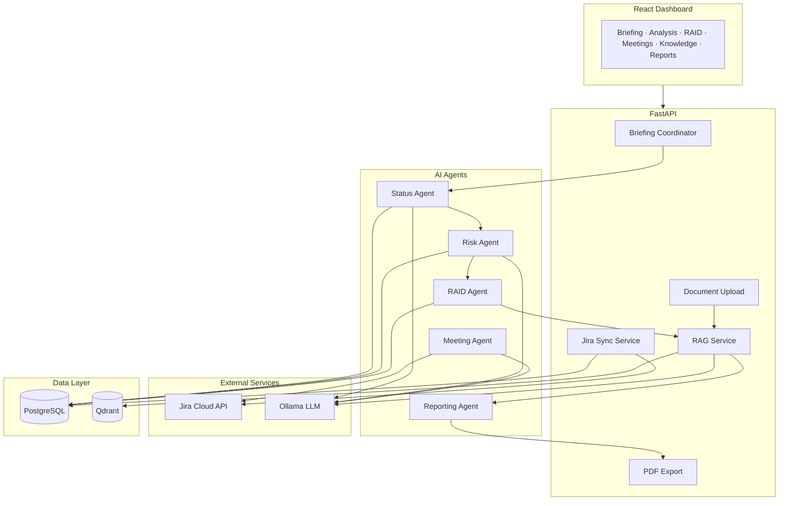

# PMO Intelligence Platform

AI-powered PMO intelligence platform demonstrating agentic AI, enterprise Jira integration, RAG-backed governance citations, multi-agent orchestration, and executive reporting with PDF export.

📎 **[Project overview (Gist)](https://gist.github.com/andrew21-mch/75e7a8dbb1b98f77356c7f4878650387)** — concise portfolio summary with architecture, demo flow, and API reference.

## Features

| Capability | Description |
|------------|-------------|
| **Jira Integration** | Sync projects, issues, epics, sprints, and assignees from Jira Cloud |
| **Status Agent** | Executive health summary, sprint progress, overdue/blocked work |
| **Risk Agent** | Rule-based risk detection with optional LLM enrichment |
| **RAID Agent** | Auto-generates Risks, Assumptions, Issues, Dependencies |
| **Meeting Agent** | Transcript analysis → actions, decisions, risks; optional Jira ticket creation |
| **RAG Knowledge Base** | Upload governance docs; agents cite them in reports |
| **Reporting Agent** | Weekly / monthly / steering committee templates (HTML + PDF) |
| **PMO Briefing** | One-click pipeline orchestrating all agents with latency metrics |

## Stack

| Layer | Technology |
|-------|------------|
| Backend | Python, FastAPI |
| AI | Ollama (local) or OpenAI, **LangGraph** orchestration |
| Database | PostgreSQL |
| Vector DB | Qdrant |
| Frontend | React, Vite |
| Deployment | Docker, GitHub Actions |

## Quick Start

```bash
cp .env.example .env
# Edit .env with Jira credentials (optional for demo mode)

docker-compose up --build -d
```

- **Frontend:** http://localhost:5173
- **API:** http://localhost:8000
- **API docs:** http://localhost:8000/docs

## Demo Without Jira

1. Open the dashboard and click **Load Demo Data**
2. Select project **DEMO** from the project dropdown
3. Go to **Knowledge Base** tab → **Load Sample Governance Doc**
4. Go to **PMO Briefing** tab → **Generate PMO Briefing**
5. Review pipeline timings, then open **Reports** tab → **Download PDF**

## Demo With Jira

1. Configure `.env` with your Atlassian credentials (see below)
2. Recreate the API container after editing `.env`:

```bash
docker rm -f portfolio_api_1
docker-compose up -d api
```

3. Click **Sync Jira** in the header
4. Select your project (e.g. **SCRUM**)
5. **Projects** tab → upload a CSV to bulk-create Jira tasks (or import locally)
6. **Generate PMO Briefing** for a full end-to-end run

## CSV Task Import

Import tasks from a spreadsheet on the **Projects** tab.

1. Click **Download Template** for the expected format
2. Fill in rows (required column: `summary`)
3. **Upload CSV** — with **Push to Jira** checked to create real Jira issues and auto-sync

**Optional columns:** `description`, `issue_type`, `priority`, `due_date`, `status`, `assignee`

Uncheck **Push to Jira** to import into the local database only (useful for demo mode without Jira credentials).

```bash
curl -O http://localhost:8000/api/jira/import/csv/template
curl -X POST http://localhost:8000/api/jira/import/csv \
  -F "project_key=SCRUM" \
  -F "push_to_jira=true" \
  -F "file=@pmo-tasks-template.csv"
```

## LLM — Local Ollama (default)

No OpenAI key required. The platform uses Ollama via its OpenAI-compatible API.

```bash
ollama pull llama3.2
ollama pull nomic-embed-text   # embeddings for RAG
```

In `.env` (Docker defaults):

```
LLM_PROVIDER=ollama
OLLAMA_BASE_URL=http://ollama:11434/v1
OLLAMA_MODEL=llama3.2
OLLAMA_EMBED_MODEL=nomic-embed-text
```

To use OpenAI instead: `LLM_PROVIDER=openai` and `OPENAI_API_KEY=...`.

If Ollama is unreachable, agents fall back to rule-based output gracefully.

## Jira Setup

1. Create an [Atlassian API token](https://id.atlassian.com/manage-profile/security/api-tokens)
2. Add to `.env`:

```
JIRA_BASE_URL=https://your-domain.atlassian.net
JIRA_EMAIL=you@company.com
JIRA_API_TOKEN="your-token-here"
```

Quote the token if it ends with `=`.

3. Sync via **Sync Jira** in the UI or:

```bash
curl -X POST http://localhost:8000/api/jira/sync
```

## Architecture



### PMO Briefing Pipeline (LangGraph)

The briefing orchestrator is a **LangGraph `StateGraph`** (`backend/app/graphs/briefing_graph.py`):

```
START → status_agent → risk_agent → raid_agent → rag_agent → report_agent → END
```

Each node is an async LangGraph node that updates shared state and appends pipeline timing metrics. `BriefingCoordinator` invokes the compiled graph via `briefing_graph.ainvoke()`.

## Key API Endpoints

| Endpoint | Description |
|----------|-------------|
| `POST /api/jira/sync` | Sync all Jira projects |
| `POST /api/jira/import/csv` | Import tasks from CSV (Jira or local) |
| `GET /api/jira/import/csv/template` | Download sample CSV template |
| `POST /api/agents/projects/{key}/briefing` | Full PMO briefing pipeline |
| `GET /api/agents/projects/{key}/status` | Status agent output |
| `GET /api/agents/projects/{key}/risk` | Risk agent output |
| `POST /api/agents/projects/{key}/raid/generate` | Generate RAID log |
| `POST /api/agents/projects/{key}/meetings/analyze` | Meeting intelligence |
| `POST /api/documents/upload` | Upload governance document |
| `POST /api/agents/projects/{key}/reports/generate` | Executive report |
| `POST /api/agents/reports/pdf` | Export report as PDF |
| `POST /api/dev/seed` | Load demo data (no Jira) |

## Project Structure

```
backend/
  app/agents/          # Status, Risk, RAID, Meeting, Reporting agents
  app/graphs/          # LangGraph StateGraph orchestration
  app/api/             # FastAPI route handlers
  app/integrations/    # Jira client + sync
  app/services/        # RAG, embeddings, briefing coordinator, PDF export
frontend/
  src/App.tsx          # Tabbed dashboard
docker-compose.yml     # Postgres, Qdrant, Ollama, API, frontend
```

## Troubleshooting

**`ContainerConfig` error on `docker-compose up`**

```bash
docker rm -f portfolio_api_1
docker-compose up -d --force-recreate api
```

**Jira auth failing after `.env` change**

```bash
docker rm -f portfolio_api_1
docker-compose up -d api
```

**Agents return fallback text**

Ensure Ollama is running and the model is pulled inside the container:

```bash
docker exec portfolio_ollama_1 ollama pull llama3.2
```

## License

MIT
