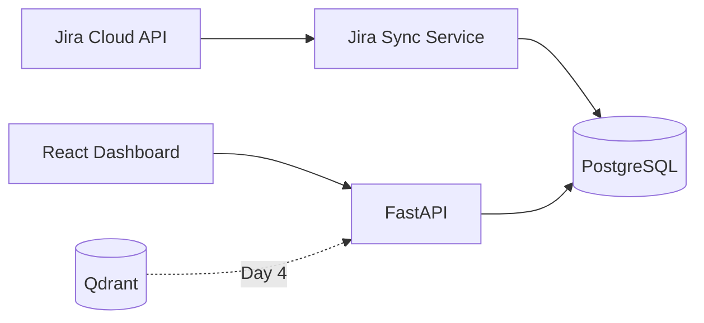

# PMO Intelligence Platform

AI-powered PMO intelligence platform demonstrating agentic AI, enterprise integrations, RAG, and multi-agent orchestration.

## Stack

| Layer | Technology |
|-------|------------|
| Backend | Python, FastAPI |
| AI | Ollama (local) or OpenAI, LangGraph |
| Database | PostgreSQL |
| Vector DB | Qdrant |
| Frontend | React, Vite |
| Deployment | Docker, GitHub Actions |

## Quick Start

```bash
cp .env.example .env
# Edit .env with your Jira credentials (see below)

docker-compose up --build -d
```

- API: http://localhost:8000
- API docs: http://localhost:8000/docs
- Frontend: http://localhost:5173

## LLM — Local Ollama (default)

No OpenAI key required. The platform uses Ollama via its OpenAI-compatible API.

1. Install and start Ollama: https://ollama.com
2. Pull a model: `ollama pull llama3.2`
3. In `.env` (defaults are fine for Docker):

```
LLM_PROVIDER=ollama
OLLAMA_BASE_URL=http://host.docker.internal:11434/v1
OLLAMA_MODEL=llama3.2
```

If running the API **outside Docker**, use `OLLAMA_BASE_URL=http://localhost:11434/v1`.

To use OpenAI instead, set `LLM_PROVIDER=openai` and `OPENAI_API_KEY=...`.

## Jira Setup

1. Create an [Atlassian API token](https://id.atlassian.com/manage-profile/security/api-tokens)
2. Edit `.env` with your real values:

```
JIRA_BASE_URL=https://your-domain.atlassian.net
JIRA_EMAIL=you@company.com
JIRA_API_TOKEN=your-token-here
```

3. Restart the API container after editing `.env`:

```bash
docker-compose restart api
```

4. Sync via the **Sync Jira** button in the UI, or:

```bash
curl -X POST http://localhost:8000/api/jira/sync
```

## Architecture (Day 1)



## License

MIT
# pmo-intelligence
# pmo-intelligence
